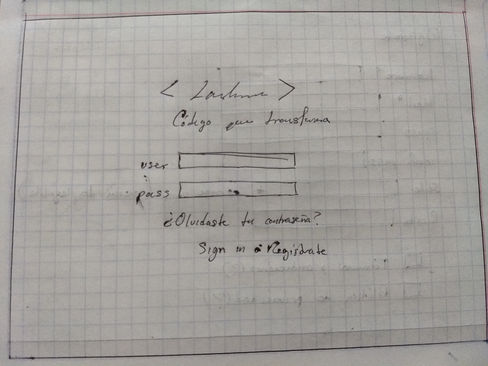
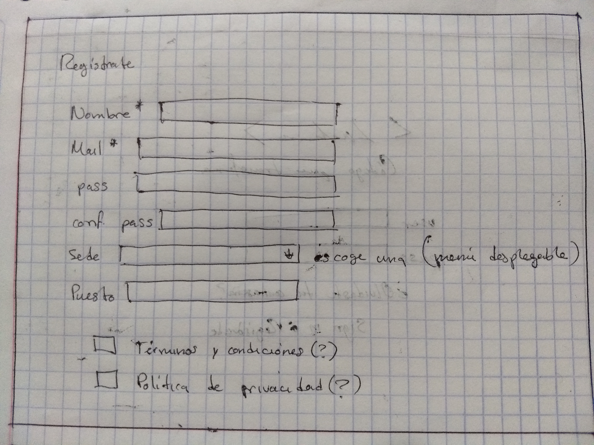
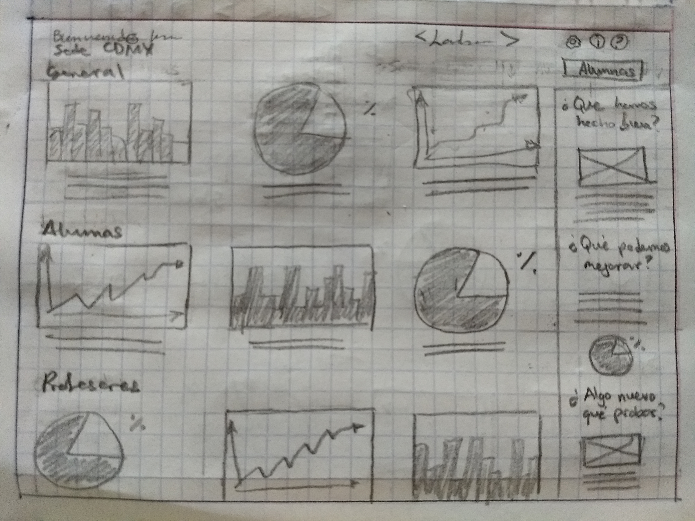

# RETOS DE CÓDIGO

## 1. Sobre la web de *Laboratoria*: explica qué partes conforman el UX y qué partes el UI

### UI

1. Maquetacipon amigable con el usuario.
2. Estilos: colores, fuentes, tamaños, etc.
3. Donde va colocado el logo
4. Tal vez propuso la imagen que reflejara la idea que se quiere transmitir acerca de Laboratoria.
5. Diseño de la interfaz en modo responsive, tomando en cuenta cómo se vizualizaría en diferentes dispositivos.
6. Diseño de la barra fija para compartir en redes sociales.
7. Proponer la combinación de colores más adecuada.
8. Lograr una experiencia de navegación placentera para el usuario en base a los resultados arrojados por las pruebas de UX.
9. Hacer propuestas estéticas agradables a la vista pero que no dejen de transmitir el mensaje que Laboratoria desea hacer llegar al usuario.
10. Adaptar el diseño de interfaz de acuerdo a los resultados obtenidos tanto en las pruebas de usabilidad como en otras pruebas realizadas con el usuario. 

### UX

1. La distribución de la información en la página y el orden en que se va a mostrar.
2. Cómo debe ser la imagen del Home, la que va a ser la primera impresión del mensaje que laboratoria desea transmitir.
3. Qué y cómo se van a presentar los elementos de llamada a la acción.
4. Cómo se van a presentar los textos.
5. Qué deben de inspirar en el usuario los textos junto con las imágenes. 
6. Asegurarse de que la interfaz sea amigable con el usuario.
7. Reconoce la importancia de incluir los logos de las empresas, instituciones y personalidades que apoyan a laboratoria, así como los reconocimmientos y galardones obtenidos.
8. Asegurarse de que la navegación resultara sencilla, directa e intuitiva.
9. Realizar pruebas de usabilidad.
10. Realizar pruebas diversas en las que se puedan detectar las emociones que se generan en el usuario al entrar en contacto con la interfaz y su contenido.
11. Pensar en el tipo de tecnología que se va a usar, es decir, si el target son chicas de escasos recursos, probablemente no tengan acceso a una buena conexión a internet por lo que necesitamos una página clara y ligera, de carga rápida pero que no demerite su contenido ni su aspecto estético. 

## 2. Identifica los elementos de navegación de: *Github*

1. En la Página principal se encuentra la barra de navegación global, misma que podemos observar constantemente mientras exploramos todo el site. 
2. En la pestaña features, vemos una barra de navegación local en la que expone opciones como: code review, project management, integration, etc.
3. En bussiness, el tipo de navegación es más bien lineal, con enlaces colocados entre los textos, aunque tiene una barra de navegación local con opciones propias.
4. En Explore, la barra superior es de navegación tipo contextual, y en general en este apartado s enos ofrecen ligas para conocer las diversas prestaciones que nos ofrece Github.
5. En marketplace nuevamente vemos una barra de navegación contextual, y abajo a la izquierda una barra de navegación suplementaria.
6. En pricing ya se nos hacre una llamada a la acción al presentar los planes de pago y comparativas.

## 3. Crea un *sketch* para la herramienta del dashboard de Laboratoria.

## Dashboard Laboratoria: Primer sketch 

## Entrada: Log in & Sign in

Registro: 
Datos personales
¿En este caso aplican los "Términos y condiciones?" y la "Política de Privacidad"?

Home:
Barra de navegación:
Bienvenida con nombre de usuario
Logo
Configuración, info, ayuda
Sede-menu desplegable
Botón alumnas

### Primera Sección:

Mis estadísticas - preferencias establecidas por usuari@ en la configuración o los datos consultados con mayor frecuencia o los últimos datos consultados.

### Segunda sección:

Datos y estadísticas que muestren un panorama general de la sede de usuari@

### Tercera sección:
Datos y estadísticas que muestren un panorama general de todo Laboratoria

### Barra lateral:
Inspirada en el daily stand up y las retrospectivas a final de Sprint, muestran los aciertos, las áreas de oportunidad y cosas que se pueden cambiar para alcanzar los objetivos. 

## Sede.

Al seleccionar una sede del menú desplegable aparecen los datos y estadísticas de la sede en general, por turnos o grupos, sí los hay y otros datos relevantes propios de la sede que se consulta. También tiene su barra lateral con los aciertos, cosas nuevas por probar y áreas de oportunidad.

## Alumnas.

En Alumnas hice una primera versión con una barra de búsqueda y al lado la leyenda "filtrar", sin embargo, después de una primera interacción, eliminé "filtrar" y metí los filtros como opciones dentro de la propia barra. Estás opciones permitirían ver el rendimiento, los datos y las estadísticas de las alumnas por sede, grupo, turno, squad o de manera individual.

La última imagen corresponde a cómo se vería una consulta individual. En la primera parte: la foto de la alumna, sus datos personales y su rendimiento duarante el sprint en curso. Abajo sus estadísticas por rendimiento general técnico y HSE y estas mismas estadísticas desglosadas por sprint. Al derecha, la barra lateral con las fortalezas y áreas de oportunidad y un formulario por si se desea enviar comentarios acerca de la alumna. 

